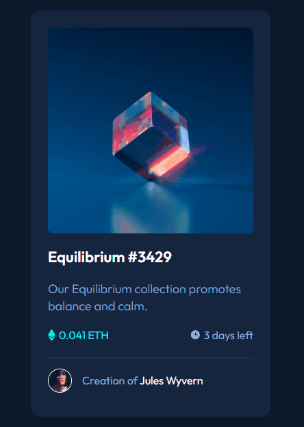

# Frontend Mentor - NFT preview card component solution

This is a solution to the [NFT preview card component challenge on Frontend Mentor](https://www.frontendmentor.io/challenges/nft-preview-card-component-SbdUL_w0U). 
## Table of contents

- [Overview](#overview)
  - [The challenge](#the-challenge)
  - [Screenshot](#screenshot)
- [My process](#my-process)
  - [Built with](#built-with)
  - [What I learned](#what-i-learned)
  - [Continued development](#continued-development)
- [Acknowledgments](#acknowledgments)

## Overview

### The challenge

Users should be able to:

- View the optimal layout depending on their device's screen size
- See hover states for interactive elements

### Screenshot



## My process

### Built with

- Semantic HTML5 markup
- CSS custom properties
- Flexbox
- CSS Grid

### What I learned

As this was my first project/challenge, I could learn some important things with it. The first thing was how to keep the CSS more organized, through a better division of the files, separating them by functions. Second, it was very usefulto learn how to set variables on CSS, as they can make life easier if any changes to the code are needed later. As an exemple of these variables, we have on the project those created for identifying colors: 

```css
:root {
    --primary-soft: hsl(215, 51%, 70%);
    --primary-medium: hsl(178, 100%, 50%);

    --neutral-dark: hsl(217, 54%, 11%);
    --neutral-medium: hsl(216, 50%, 16%);
    --neutral-soft: hsl(215, 32%, 27%);
}
```

In addition, it was also useful to understant a little more about how to use *hover*, and also see more examples of how to apply *before* and *after*. 

### Continued development

Even though the project has helped me to improve my concepts about *before* and *after*, they ar still concepts that I don't fully understand at times and, because of that, I believe it is important is important to study their functionality in more depth.

## Acknowledgments

This Frontend Mentor challenge was solved with the help of an explanatory class from the frontend course provided by Dev em Dobro (https://github.com/devemdobro).

